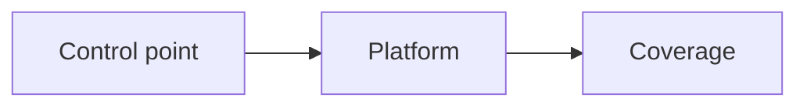
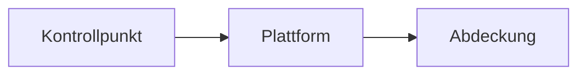

# Complydance — How it works 

This document describes **usage and user flow** of the interactive single-page app.

## Summary

The explorer presents the **Sophos Central Platform** as a layered diagram and links individual **GSE platform features** (tiles) to requirements from **NIS2**, **ISO/IEC 27001:2022 Annex A**, **DORA**, and **BSI** catalogues (e.g. Grundschutz++). It targets **presales and solution mapping**: mappings are **illustrative**; authoritative wording and certifications are with primary sources and the [Sophos Trust Center](https://www.sophos.com/en-us/trust). **Not legal advice.**

## Getting started

- The app is **a single HTML file with no build step**: open locally in the browser or serve via static hosting (e.g. GitHub Pages).
- **Data is embedded in the HTML.**

## UI at a glance

| Area | Function |
|------|----------|
| **Framework switcher** | NIS2, ISO 27001, DORA, BSI — controls which requirement IDs and texts appear in the control list and detail view. |
| **BSI catalogue** | Only when framework is **BSI**: select sub-catalogue (e.g. Grundschutz++). |
| **Language** | DE / EN for the UI. |
| **Control list** | Filters **All**, **Applicable only**, **Gap** (audit scope without qualified product/platform mapping — see architecture doc). |
| **Risk reduction** | Toolbar: opens a **model** risk panel when applicable (not a substitute for CRQ or insurance advice). |
| **Stack view** | Shows **combined** coverage of multiple selected solutions against the active framework. |
| **Diagram** | Layers: Managed / Advisory Services, Data Controls, Integrations, SecOps, Threat Intel & AI, **Data Lake**, footer (e.g. AI-assisted workflows). Click a **tile** to open detail. |

## User flow: three steps

The app moves from **control point** via **platform** to **coverage** (visible e.g. in the detail header).

1. **Step 1 — Control list:** Select a **requirement** in the control list *or* click a **tile** in the platform diagram directly. Some related topics highlight multiple tiles together to show relationships.
2. **Step 2 — Platform:** The selection determines which **GSE feature** and **Sophos solution** (as shown in detail) are in focus.
3. **Step 3 — Coverage:** The **detail panel** shows **requirement IDs** for the active framework including short texts/metadata and actions (stack, export).

## Detail panel

| Tab | Content |
|-----|---------|
| **Overview** | Mapped **Sophos solution** and **requirement list** for the selected framework. |
| **PDCA** | Where data exists: **PDCA cycle** and effectiveness/risk model. The **PDCA effectiveness** view is **independent** of control-list filter and stack — it is illustrative, not a gap list. |
| **Actions** | Back to main view, **Add to stack**, **Copy text for opportunity** (Markdown), **Print** (browser print / PDF). |

**Stack:** Add multiple features and see **joint** requirement coverage in the stack view — useful for conversations about broader portfolio combinations.

## Framework-specific notes

- Switching framework changes **labels and lists** (NIS2 articles, ISO controls `A.x.y`, DORA articles, BSI requirements from OSCAL).
- **BSI:** Control titles and catalogue data come from the [Stand der Technik Bibliothek](https://github.com/BSI-Bund/Stand-der-Technik-Bibliothek) (**CC BY-SA 4.0**); the app shows the corresponding notices.

-------

# Complydance — Funktionsweise

Dieses Dokument beschreibt die **Bedienung und den Nutzerfluss** der interaktiven Single-Page-App.

## Kurzbeschreibung

Der Explorer zeigt die **Sophos Central Platform** als geschichtetes Diagramm und verknüpft einzelne **GSE-Plattform-Features** (Kacheln) mit Anforderungen aus **NIS2**, **ISO/IEC 27001:2022 Anhang A**, **DORA** und **BSI**-Katalogen (z. B. Grundschutz++). Er richtet sich an **Presales und Solution Mapping**: Die Zuordnungen sind **illustrativ**; verbindliche Texte und Zertifizierungen liegen bei den Primärquellen bzw. beim [Sophos Trust Center](https://www.sophos.com/de-de/trust). **Keine Rechtsberatung.**

## Start

- Die App ist **eine HTML-Datei ohne Build-Schritt**: lokal im Browser öffnen oder über statisches Hosting (z. B. GitHub Pages) ausliefern.
- **Daten sind in der HTML eingebettet** 

## Oberfläche in einem Blick

| Bereich | Funktion |
|--------|----------|
| **Framework-Umschalter** | NIS2, ISO 27001, DORA, BSI — steuert, welche Anforderungs-IDs und -Texte in Kontrollliste und Detail erscheinen. |
| **BSI-Katalog** | Nur bei Framework **BSI**: Auswahl des Unterkatalogs (z. B. Grundschutz++). |
| **Sprache** | DE / EN für die Oberfläche. |
| **Kontrollliste** | Filter **Alle**, **Nur zutreffende**, **Gap** (Prüfscope ohne qualifizierte Produkt-/Plattform-Zuordnung — siehe Architektur-Dokument). |
| **Risikoreduktion** | Werkzeugleiste: öffnet bei passender Auswahl ein Panel zur **Modell**-Risikobetrachtung (kein Ersatz für CRQ oder Versicherungsberatung). |
| **Stack-Ansicht** | Zeigt **kombinierte** Abdeckung mehrerer ausgewählter Lösungen gegenüber dem aktiven Framework. |
| **Diagramm** | Schichten: Managed / Advisory Services, Data Controls, Integrations, SecOps, Threat Intel & AI, **Data Lake**, Fußzeile (z. B. AI-Assisted Workflows). Klick auf eine **Kachel** öffnet das Detail. |

## Nutzerflow: drei Schritte

Die App führt inhaltlich von **Kontrollpunkt** über **Plattform** zu **Abdeckung** (sichtbar u. a. im Detail-Header).

1. **Schritt 1 — Kontrollliste:** Eine **Anforderung** in der Kontrollliste wählen *oder* direkt eine **Kachel** im Plattform-Diagramm anklicken. Einige zusammenhängende Themen heben mehrere Kacheln gemeinsam hervor, um den Zusammenhang zu verdeutlichen.
2. **Schritt 2 — Plattform:** Die Auswahl bestimmt, welches **GSE-Feature** und welche **Sophos-Lösung** (Darstellung im Detail) im Fokus stehen.
3. **Schritt 3 — Abdeckung:** Im **Detail-Panel** erscheinen die zum aktiven Framework passenden **Anforderungs-IDs** inkl. Kurztexten/Metadaten sowie Aktionen (Stack, Export).

## Detail-Panel

| Tab | Inhalt |
|-----|--------|
| **Überblick** | Zugeordnete **Sophos-Lösung** und **Anforderungsliste** für das gewählte Framework. |
| **PDCA** | Wo Daten vorliegen: **PDCA-Zyklus** und Wirksamkeits-/Risiko-Modell. Die **PDCA-Wirksamkeits**-Darstellung ist **unabhängig** von Kontrolllisten-Filter und Stack — sie dient der Illustration, nicht der Lückenliste. |
| **Aktionen** | Zurück zur Hauptansicht, **Zum Stack hinzufügen**, **Text für Opportunität kopieren** (Markdown), **Drucken** (Browser-Druck / PDF). |

**Stack:** Mehrere Features aufnehmen und in der Stack-Ansicht die **gemeinsame** Abdeckung der Anforderungen sehen — sinnvoll für Gespräche über erweiterte Portfolio-Kombinationen.

## Framework-spezifisches

- Beim Wechsel des Frameworks ändern sich **Bezeichnungen und Listen** (NIS2-Artikel, ISO-Kontrollen `A.x.y`, DORA-Artikel, BSI-Anforderungen aus OSCAL).
- **BSI:** Kontrolltitel und Katalogdaten stammen aus der [Stand-der-Technik-Bibliothek](https://github.com/BSI-Bund/Stand-der-Technik-Bibliothek) (**CC BY-SA 4.0**); die App zeigt entsprechende Hinweise.
